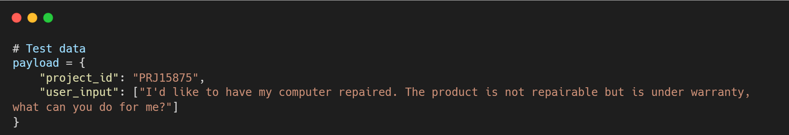
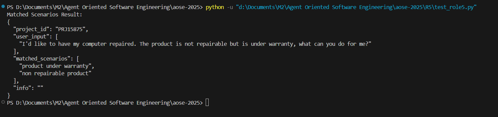

## Role 5 - Scenarios Matcher

### Author
Role R5; **Nassim Lattab**

**Purpose:**
This script implements Role 5 in our multi-role system. It is responsible for matching user input phrases with scenarios associated with a specific project. More precisely, **Role 5** processes user input to match it against predefined scenarios retrieved from the Ai-Raison API. The process involves receiving a project identifier and user phrases, constructing a detailed prompt for a locally hosted LLM, and finally parsing the response to extract the matched scenarios. All results are formatted in JSON and forwarded to for further processing. 

The script is as follows:

1. **Retrieves** the list of scenarios for a given project from the Ai-Raison API.
2. **Builds** a prompt that combines the retrieved scenarios with user phrases.
3. **Sends** the prompt to a locally hosted LLM API (via FastAPI) for matching.
4. **Extracts** and returns the matching scenarios from the LLM’s JSON response.
5. **Formats** the output as JSON to be forwarded to the Broker.

### Project Overview

In our multi-role architecture, **Role 5** handles the scenario matching process:

- **Input:**\
In order to function properly, **Role 5** relies on two key inputs that allow it to fetch relevant scenarios and understand the user’s needs:
    - **Project Identifier (`project_id`):**\
    A unique string that is used to query the Ai-Raison API. This API returns project metadata including all available scenarios (elements) and options.  
    *Example:* `"PRJ15875"`
  
    - **User Input Phrases (`user_input`):**  
    A list of sentences that express the user's requirements or requests.  
    *Example:* `["I'd like to have my computer repaired."]`
    
    These inputs are typically provided as JSON in a POST request to the `/match` endpoint. A **Pydantic** model ensures that `project_id` is a string and `user_input` is a list of strings, offering basic validation. 

- **Process:**
    1. The script constructs an API URL using the project ID and fetches metadata from the Ai-Raison API.
    2. It extracts scenario labels from the metadata.
    3. It builds a detailed prompt combining the list of scenarios and the user phrases, instructing the LLM to return a JSON object with the matched scenarios.
    4. It calls the LLM API (running locally at `http://localhost:8000/generate`) to get a response.
    5. The raw LLM output is preprocessed using regex to extract only the JSON block.
    6. The extracted JSON is parsed and returned as a dictionary.

- **Output:**\
After processing the inputs, Role 5 generates a structured JSON object that encapsulates both the original request and the system’s matching results. 
The final output is a JSON object that contains:
  - **project_id**: The project identifier.
  - **user_input**: The original user input text.
  - **matched_scenarios**: An array containing the scenarios that best match the user's input.
  - **info**: A string field for additional information (e.g., error messages or processing details). This field may be empty on success.
Below is a global structure for the final output:

    ```json
    {
        "project_id": "PRJID05",
        "user_input": ["The user input text here."],
        "matched_scenarios": [
            "scenario1", "scenario2"
        ],
        "info": "..."
    }
    ```
    *Note* : The list may include additional scenario names.

### Algorithm 

The matching algorithm in Role 5 orchestrates a sequence of operations designed to retrieve relevant scenarios, construct a suitable prompt, interact with the LLM, and deliver the final results. The process follows these detailed steps:
#### Unified Processing Flow and Algorithm

1. **Scenario Retrieval**

    - **API Call & Metadata Parsing**\
    The function `get_project_scenarios(project_id)` constructs an endpoint URL (for instance,
    `https://api.ai-raison.com/executions/PRJ15875/latest`) and calls `get_data_api(url, api_key)` to fetch the project metadata.
    Next, `extract_elements_and_options(metadata)` parses this metadata to extract scenario labels, retaining only the keys (scenario names) as the list of possible scenarios.

2. **Prompt Construction**
    - **Instruction & Formatting**\
    The function `build_prompt(scenarios, user_input)` creates a prompt instructing the LLM to match user requests with the provided scenarios and to return only a strict JSON output. Specifically, the prompt includes:
        - A clear directive for the LLM.
        - The list of retrieved scenarios (formatted as a comma-separated string).
        - The user input phrases.

3. **LLM Invocation and Response Processing**
    - **Call LLM API**\
        The function `call_llm(session_id, prompt, host)` sends the prompt to the LLM API (e.g., `http://localhost:8000/generate`), specifying parameters such as `max_new_tokens`, `temperature`, and `repetition_penalty` to shape the generation process.
    - **Response Handling**\
        The raw response from the LLM is processed using a regular expression to extract the JSON block. If extraction or parsing fails, the algorithm logs an error and returns an empty `matched_scenarios` list with a relevant message in the `info` field.

4. **Final Output and Forwarding**
    - After the JSON is successfully parsed, the system enriches the result by adding the original `project_id` and `user_input` fields, and sets the `info` field to empty upon success.
    - The resulting JSON object is then forwarded to the Broker via an HTTP POST.

#### Pseudocode Representation
```python
def match_scenarios_with_llm(project_id, user_input):
    scenarios = get_project_scenarios(project_id)
    prompt = build_prompt(scenarios, user_input)
    llm_output = call_llm("matching_scenarios_session", prompt)
    
    extracted_json = extract_JSON(llm_output)
    if not extracted_json:
        result = error_result(project_id, user_input, "No JSON object found")
    else:
        parsed_result = parse_JSON(extracted_json)
        if not parsed_result:
            result = error_result(project_id, user_input, "Could not parse JSON")
        else:
            result = formatted_result(project_id, user_input, parsed_result)
    
    send(result)
    return result
```
This step-by-step algorithm ensures that the user input is accurately matched to the available scenarios by leveraging the generative capabilities of the LLM while enforcing strict JSON output for reliable downstream processing.

### Code Structure

- **Configuration:**
    Sensitive data such as the API key are stored in a separate configuration file `(config.py)`.
    Note: Ensure that this file is excluded from version control (e.g., via .`gitignore`).

- **Functions:**
    - `extract_elements_and_options(metadata)`\
        Extracts scenario labels (elements) and options from the metadata.

    - `get_data_api(url, api_key)`\
        Retrieves JSON data from the Ai-Raison API.

    - `get_project_scenarios(project_id)`\
        Constructs the URL and extracts a list of scenario labels for the specified project.

    - `build_prompt(scenarios, user_phrases)`\
        Creates a prompt that instructs the LLM to perform scenario matching using only JSON output.

    - `call_llm(session_id, prompt, host)`\
        Sends the prompt to the local LLM API endpoint and retrieves the response.

    - `match_scenarios_with_llm(project_id, user_phrases)`\
        Orchestrates the entire process from retrieving scenarios to parsing the LLM's JSON response.

- **Regex Preprocessing:**\
    Before attempting to parse the LLM response, a regex is used to extract only the JSON block from the raw output to handle any extra text returned by the model.
---
### Setup Instructions
#### 0. Cloning the Repository

If you have access to the repository, you can clone it with:
```bash
git clone <repository_url>
```
Then navigate to the R5 folder before starting the service.
```bash
cd R5
```

#### 1. Configuration:
Create a `config.py` file (or similar) that includes your sensitive information such as the api key for AI-Raison API:
```python
# config.py
api_key = "YOUR_API_KEY_HERE"
```
*Note* : Make sure this file is not shared or pushed to public repositories.

#### 2. Dependencies:
Install the required packages using:
```bash
pip install requests
```

#### 3. LLM API:
>**Important:** Role 5 depends on the Role 1 LLM Service to be running.

Ensure Role 1 is set up according to its README and that your local LLM API (R1) is running. You can start it with:
```bash
uvicorn app.main:app --host 0.0.0.0 --port 8000
```

Verify that the health endpoint (`http://localhost:8000/health`)  returns the expected JSON response (e.g., `{"status": "OK"}`). You can check it with the following command:
```bash
curl http://localhost:8000/health
```

#### 4. Run the Service:
Start the Role 5 service with:
```bash
uvicorn role5_service:app --host 0.0.0.0 --port 8005
```
This starts the service on port **8005**, making the following endpoints available:

- Health Check: `http://localhost:8005/health`
- Matching Endpoint: `http://localhost:8005/match`


#### 5. Testing the Communication:

You can test the service with a separate Python script (e.g., `test_role5.py`) that sends a POST request with hard-coded values, as the Broker do:
```python
import json
import requests

url = "http://localhost:8005/match"

payload = {
    "project_id": "PRJ15875",
    "user_phrases": ["I'd like to have my computer repaired"]
}

try:
    response = requests.post(url, json=payload)
    response.raise_for_status()
    result = response.json()
    print("Matched Scenarios Result:")
    print(json.dumps(result, indent=2, ensure_ascii=False))
except Exception as e:
    print("Error during test:", e)

```
Run this script with:
```bash
python test_role5.py
```

### Example Usage

For testing, if you send the following input:



The receive output is:

This JSON output can then be returned to be forwarded once it is configured.

### Notes

- **Prompt Engineering:**\
    The prompt provided to the LLM is crucial. Ensure it clearly instructs the LLM to return only valid JSON and no additional commentary.

- **Error Handling:**\
    The script includes basic error handling in case the LLM response cannot be parsed as JSON. You may further enhance this with more robust logging and recovery strategies.

- **Customization:**\
    Adjust the API URLs, generation parameters (e.g., max_new_tokens, temperature), and other configurations according to your environment and requirements.

### Log Files

Effective logging is critical for monitoring, debugging, and auditing the matching process. In our implementation, logging occurs at several key stages:

- **Request Logging:**\
    Log the incoming project_id and user_input with a timestamp when a request is received at the /match endpoint.

- **Prompt and API Call Logging:**\
    Log the complete prompt and details of the outgoing LLM API call (including parameters and session ID), as well as the raw LLM output.

- **Response Processing Logging:**\
    Log the result of the regex extraction and JSON parsing. If errors occur, log the error details and problematic output.

- **Forwarding Logging:**\
    Log the final JSON result before it is returned, along with any errors encountered during the HTTP POST.

This streamlined logging approach ensures essential traceability without excessive repetition, allowing issues to be quickly identified and resolved.
Example Log Entry we could have :
```yaml
2025-02-24 15:30:45,123 INFO [Role5] Received request for project_id: PRJ15875 with user_input: ["I'd like to have my computer repaired"]
2025-02-24 15:30:45,456 DEBUG [Role5] Constructed prompt: "You are an AI assistant that matches user requests..."
2025-02-24 15:30:46,789 DEBUG [Role5] LLM raw output: "{ "matched_scenarios": ["repair request"] }"
2025-02-24 15:30:46,900 INFO [Role5] Successfully parsed LLM response. Matched scenarios: ["repair request"]
```
This detailed logging strategy provides full traceability of the entire matching process, from the moment a request is received to when the result is forwarded to the next service. It ensures that any issues can be quickly identified and resolved, which is critical in a multi-service architecture where errors in one role can affect the overall system performance.

### R5 Conclusion

In summary, **Role 5** serves as a critical component within our multi-role architecture, bridging user input and project-specific scenarios through an LLM-based matching process. By leveraging the Ai-Raison API to retrieve scenario labels and constructing a clear, instructive prompt, this service ensures that user requests are accurately classified. Robust logging, strict JSON output handling, and optional error recovery measures further enhance reliability. Once Role 5 completes its matching task, it seamlessly forwards the results to the Broker, integrating smoothly with the broader system. This design promotes modularity, scalability, and maintainability, enabling future enhancements or customizations without disrupting the core functionality.

---