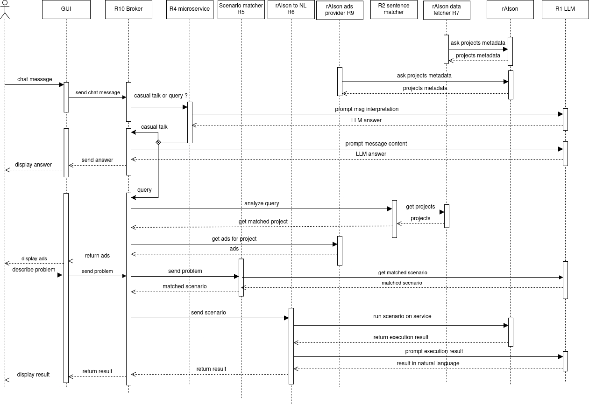

# Agent-Oriented Software Engineering Project

## Project Description

### Authors

M2 DAI Students

### Introduction

This document provides comprehensive details about the project, including the technologies employed, the project's architecture, and the division of tasks. Each role is associated with a dedicated repository (`R1`, `R2`, etc.).

#### Installation and Execution

To install the necessary dependencies for this project, please run the command: `python3 installer.py`.

To execute the project, use the command: `python3 launcher.py`.

### Technologies Used

This project is developed in Python. The API is built using Python FastAPI, a modern, fast, and reliable framework known for its performance and ease of use. The Large Language Model (LLM) utilized is `Nous-Hermes-2-Mistral-7B-DPO`, provided by HuggingFace. This LLM is deployed using a Docker container, ensuring consistent and isolated environments for development and deployment.

### Architecture

We have adapted the project's architecture from an agent-based communication model to a microservices architecture using API endpoints. Each microservice plays the role of an agent, and they are coordinated by a broker middleware which sits between the frontend and the other agents. This approach enhances the ease of creation and maintenance. Below is a sequence diagram illustrating how our application operates:

Here are the different roles and their functionalities:
- **R1 LLM Service**: Utilizes Docker to launch the LLM and creates API endpoints to query the model.
- **R2 Sentence Matcher**: A sentence matcher based on SBERT that determines which rAIson project should be queried.
- **R4 User Input Processing**: Queries R1 to ascertain whether a user input is a casual message or a query for a rAIson service.
- **R5 Scenario Matcher**: Processes user input to match it with rAIson service scenarios.
- **R6 rAIson Solution in Natural Language**: Executes the scenario on the appropriate rAIson service and queries the LLM to translate the result into natural language.
- **R7 rAIson data fetcher**: initialize an argumentation agent by fetching scenarios and options
- **R9 Matchmaking Service**: does routing requests to appropriate argumentation agents based on their advertised capabilities.
- **R10 Broker**: Acts as an interface between the GUI and the backend microservices.

### Task Division

The following students are assigned to each role:

- **R1**: Daniel Latorre
- **R2**: Tristan Duquesne
- **R4**: Thanina Ait Ferhat
- **R5**: Nassim Lattab
- **R6**: Mohamed Azzaoui
- **R7**: Lynda Benkerrou
- **R9**: Maram Beddouihech
- **R10**: Benlamara Kamilia
- **GUI**: Abdou Aziz Thiam, Yaya Latifou
- **Merging and Running Scripts**: Florian Posez, Cheikh Tidiane Diouf
- **Project coordination**: Théophile Romieu
